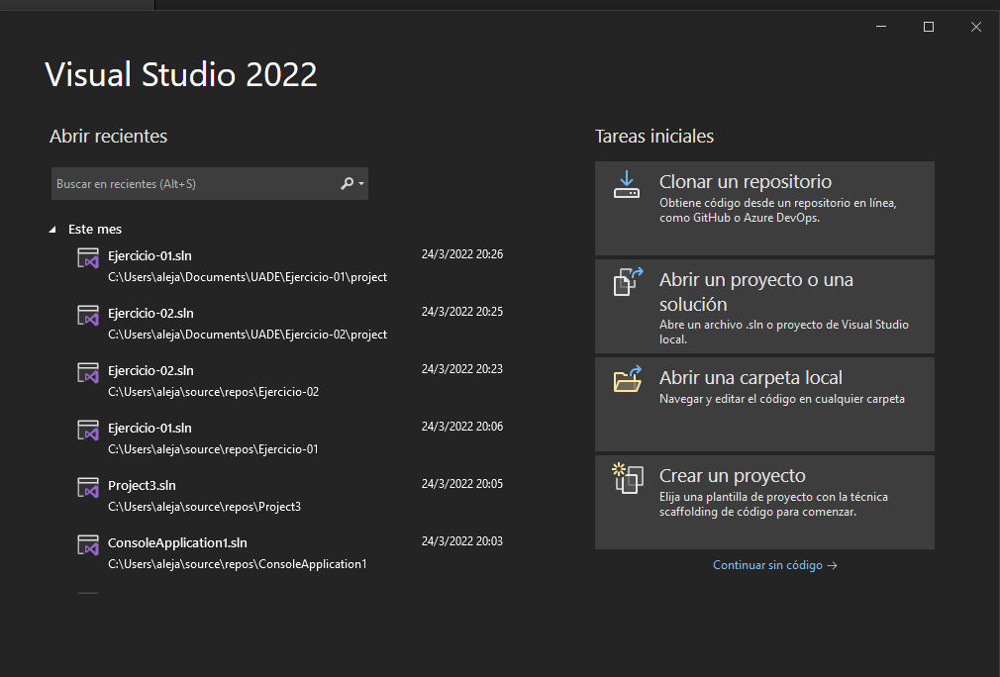
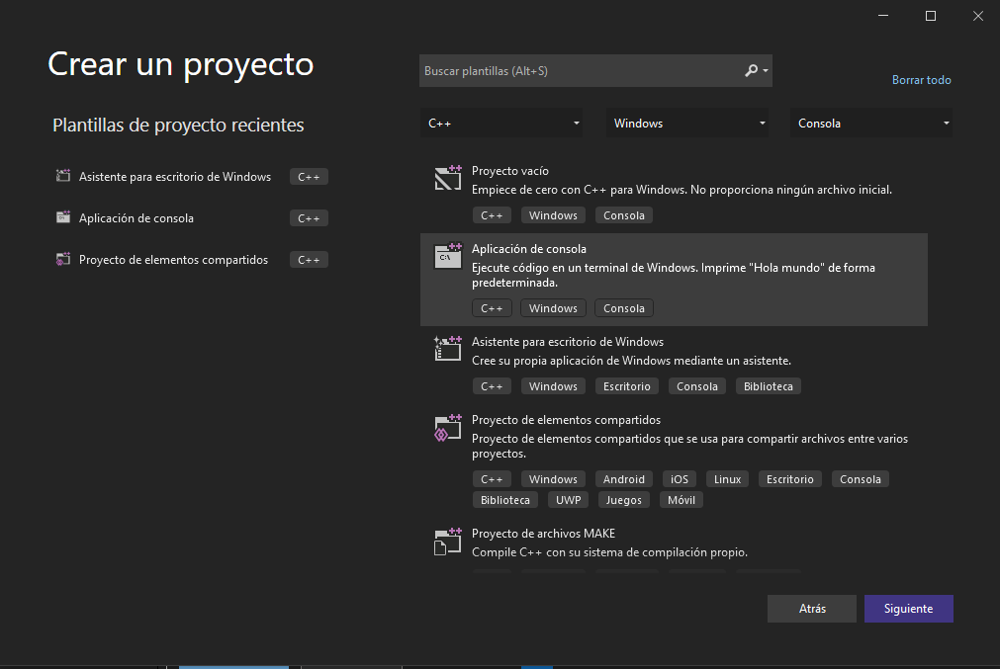
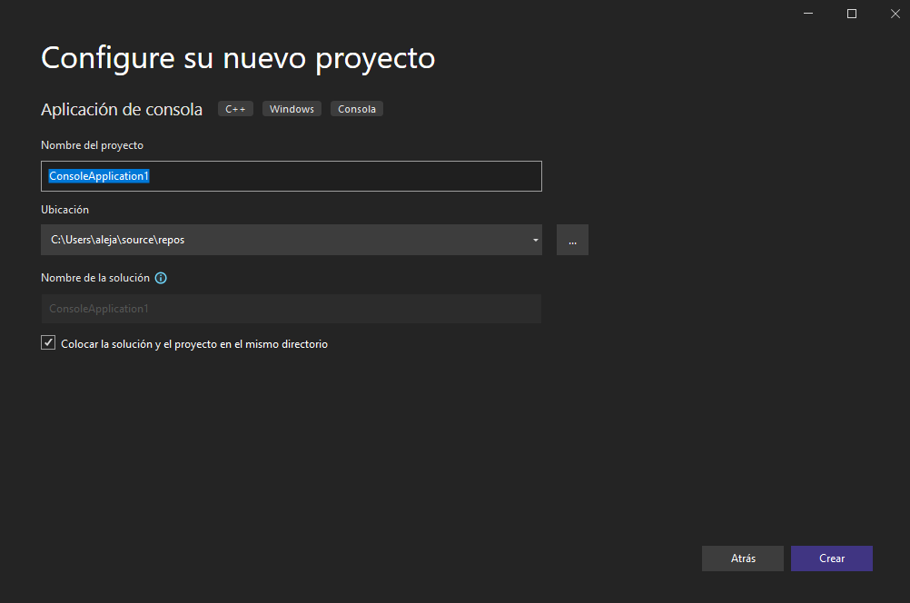
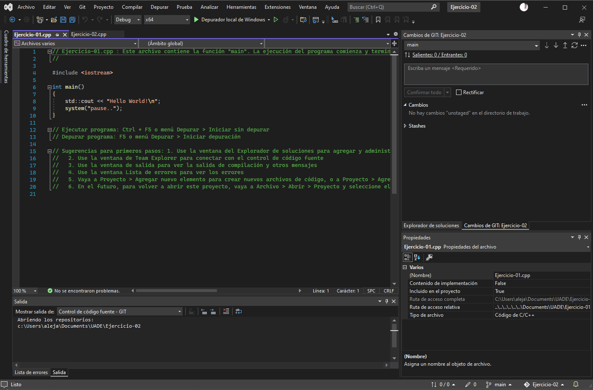

# Ejercicio-03

Deben completar una funcion max_of_four() que tome cuatro numeros como argumentos y devuelva el mayor de ellos.

Tambien deberan escribir una funcion que sume los cuatro numeros que le pasemos como argumentos. Debera llamarse sum_of_four().

Revisen el archivo Ejericio-03.cpp para ver el codigo que debe escribir.
 
> CUIDADO: DEBE definir la funcion sum_of_four() en el archivo Ejericio-03.cpp para que el programa funcione.

> Si desea usar Visual Studio 2019, abra ./project/Ejercicio-01.2019.sln

---

### Pasos para descargar Visual Studio Community Edition 2022

1.	Descargar Visual Studio Community Edition desde el siguiente Link -> [Visual Studio Community Edition Link](https://visualstudio.microsoft.com/es/thank-you-downloading-visual-studio/?sku=Community&channel=Release&version=VS2022&source=VSLandingPage&cid=2030&passive=false)

2.	Una vez que este instalado, abrilo que vas a ver una ventana parecida a la siguiente y  hacele click en Crear un Proyecto.

 
3.	Fijate en la siguiente ventana que aparece de seleccionar "Aplicación de consola"

 
4.	Y finalmente seleccionar la carpeta destino donde se guardaran los archivos y donde podras colocar el nombre del proyecto.

 
5.	Listo ahi si podes escribir tu codigo!

 